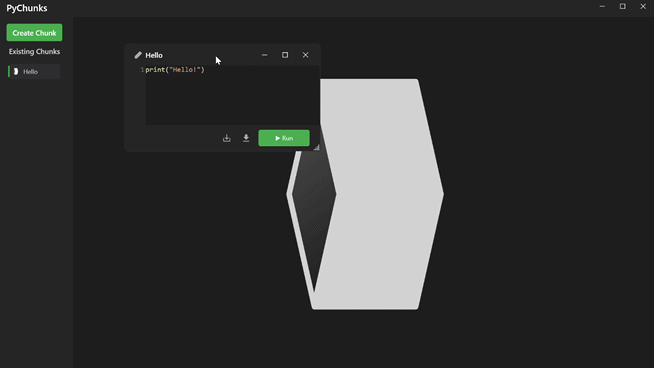

  
    
    
  

---

# PyChunks

**Version 1.1**  

A sleek and powerful tool to write, run, and manage Python code snippets effortlessly.

---

## ✨ Key Features

- ⚡ **Instant Execution**  
  Run Python code snippets instantly with just one click—no delays, no fuss.  

- 🔄 **Real-Time Output**  
  See your code results appear immediately right below each code chunk for faster feedback.  

- 🎨 **Clean & Intuitive Interface**  
  A modern, user-friendly UI that lets you focus on coding, not on navigating.  

- 🔧 **Resizable Chunks & Output**  
  Customize your workspace by resizing code chunks and their output windows to your liking.  

- 📦 **Portable & Standalone**  
  Just download the `.exe` and start coding—no installation or setup required!  

---

## 🚀 What’s New in Version 1.1

- 🛠️ **External Libraries Auto-Install**  
  Automatically installs any required Python packages when you import them.  

- 🗂️ **Spaces Support**  
  Save and load multiple code chunks within a single project file effortlessly.  

- 🐍 **Embedded Python & pip**  
  Fully embedded runtime—no need to install Python or pip separately.  

- 💻 **Improved Terminal**  
  Enhanced terminal experience with better responsiveness and features.  

- 🎨 **UI Enhancements**  
  Smoother and cleaner interface for a better coding experience.  

- 🐞 **Bug Fixes**  
  Stability and editor improvements for fewer glitches.  

- 💾 **Automatic Saving**  
  Your work is saved automatically to keep your progress safe.  

---

## 📥 Installation

1. Download the latest [`PyChunks_Installer.exe`](https://github.com/noammhod/PyChunks/releases) from the Releases section.  
2. Run the installer and follow the setup instructions.  
3. Launch PyChunks via the desktop shortcut and start coding immediately!

---

## 🛠️ How to Use

- Open PyChunks and write Python code inside the code chunks.  
- Click the **Run** button beside any chunk to execute your code instantly.  
- View output directly below the code for easy debugging and testing.  
- Resize code chunks and outputs as you wish to optimize your workspace.

---

## 📋 System Requirements

- Windows 10 / 11 (64-bit)  
- [.NET 8.0 Runtime](https://dotnet.microsoft.com/en-us/download/dotnet/8.0) (If not installed, download from Microsoft)  

---

## 💬 Support & Feedback

Questions, issues, or suggestions? Please open an issue on the [GitHub Issues page](https://github.com/noammhod/PyChunks/issues). We’re here to help!

---

## 🚫 Contributions

Currently, contributions are not open, but stay tuned for future updates and community involvement!

---

  
  *Thank you for choosing PyChunks — happy coding!*  

